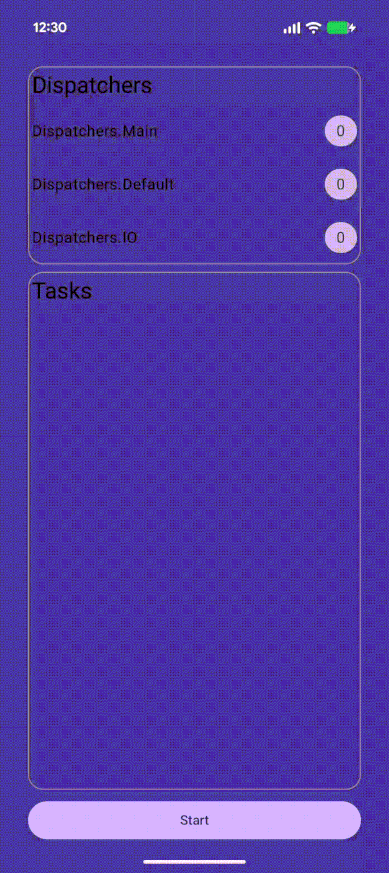
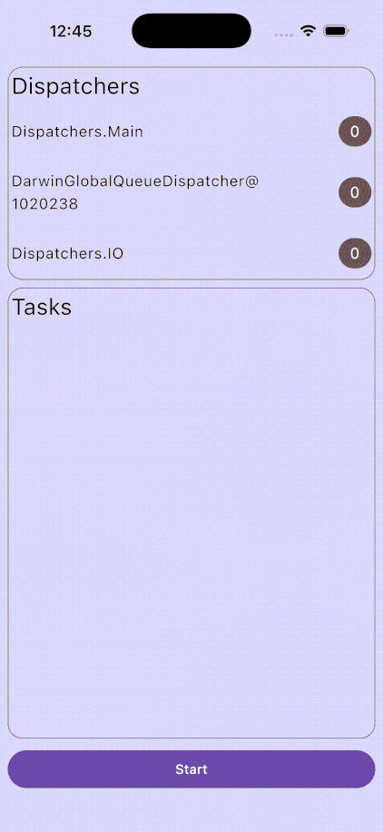

# KMP Dispatchers Test

This project tests the Kotlin Coroutines Dispatchers in a KMP mobile project (Android and iOS).

The general idea is to provide a tool that allows evaluating the use of different Dispatchers in a Multiplatform Mobile project.

## Screenshots

 

## Structure

1. [TasksProducer](composeApp/src/commonMain/kotlin/dev/magnumrocha/coroutines/core/TasksProducer.kt): Responsible for producing tasks to be processed by the [TaskProcessor](src/commonMain/kotlin/dev/magnumrocha/coroutines/core/TasksProcessor.kt).
   
   It generates random tasks in a provided time interval, using Coroutine Scope provided on its instantiation.

2. [TasksProcessor](composeApp/src/commonMain/kotlin/dev/magnumrocha/coroutines/core/TasksProcessor.kt): Responsible for processing tasks.
   
   It processes tasks by scheduling them on a Dispatcher chosen by the caller.
   By the screenshots above, the user can choose between Main, Default, IO Dispatchers.
   But feel free to define the Dispatchers and make your own tests.

3. [AppViewModel](composeApp/src/commonMain/kotlin/dev/magnumrocha/coroutines/AppViewModel.kt): The UI layer.

   It combines the TasksProducer and TasksProcessor and presents the results to the user on a [Compose UI](composeApp/src/commonMain/kotlin/dev/magnumrocha/coroutines/App.kt).
   For each task sent to the TasksProcessor, it updates the Dispatcher used to process it.

## License

    Copyright 2025 Magnum Rocha
    
    Licensed under the Apache License, Version 2.0 (the "License");
    you may not use this file except in compliance with the License.
    You may obtain a copy of the License at
    
       http://www.apache.org/licenses/LICENSE-2.0
    
    Unless required by applicable law or agreed to in writing, software
    distributed under the License is distributed on an "AS IS" BASIS,
    WITHOUT WARRANTIES OR CONDITIONS OF ANY KIND, either express or implied.
    See the License for the specific language governing permissions and
    limitations under the License.

 